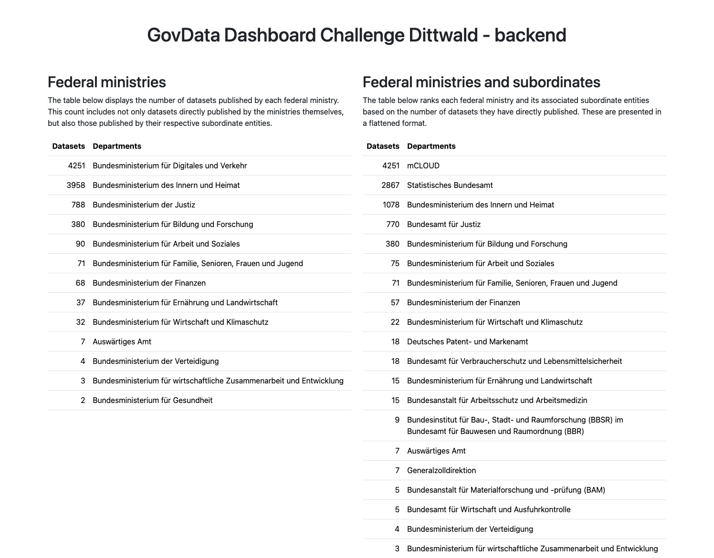

# GovData Dashboard Challenge - Backend

A small web application that provides a dashboard showing how many data sets each federal ministry has made available on GovData. States, municipalities and other institutions are ignored.




# Run with Docker

A Docker image with the dashboard application is registered at gitlab.com. This section describes how to pull and run it via Docker.

## Prerequisites

Install Docker 25.0.3. Older version might work as well, but were not tested.

## Pull and run

Pull the image from gitlab.com:

```
docker pull registry.gitlab.com/benjamin.dittwald/digitalservice-govdata-challenge-backend
```

Run the image:

```
docker run -p 8080:8080 registry.gitlab.com/benjamin.dittwald/digitalservice-govdata-challenge-backend
```

## Test it

Browse the application at [http://localhost:8080/](http://localhost:8080/).

# How to build and run

## Prerequisites

## Build

## Run

## Test it