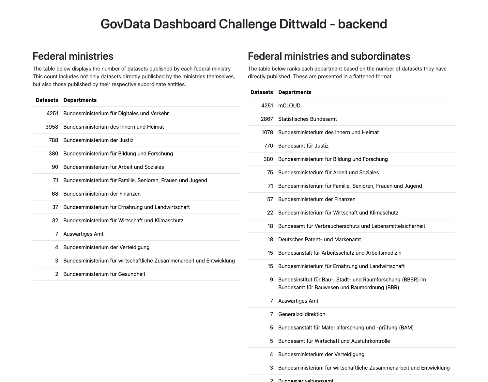

# GovData Dashboard Challenge - Backend

A small web application that provides a dashboard showing how many data sets each federal ministry has made available on GovData. States, municipalities and other institutions are ignored.

# How to build and run

## Prerequisites

## Configure

## Build

## Run